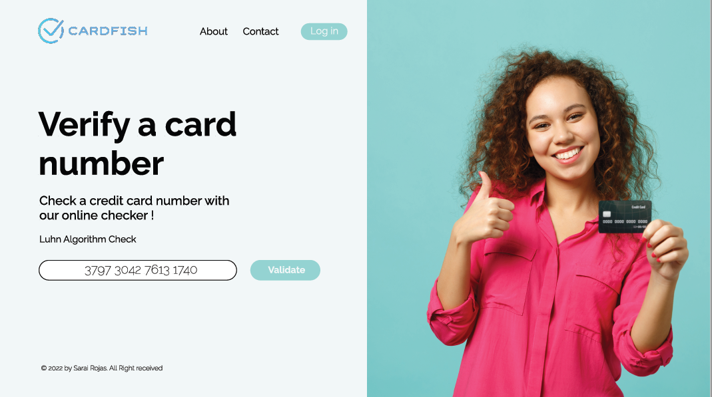

# Credit card number validator

## Index

* [1. Overview](#1-overview)
* [2. Final project image](#2-final-project-image)
* [3. UX research](#3-investigacion-UX)

***

## 1. Overview

This project consists of a web application that allows users to validate a credit card number using Luhn algorithm. A message is displayed on screen when the card number is valid or not, once the card number is validated, numbers except for the last four digits are masked. Only numbers between 13 to 18 characters are allowed, since cards numbers length falls into this range.

## 2. Final project image

<strong>Figure 1.</strong> Final project image

 

## 3. UX research

1. Who are the main users of this product?
    
   The target users are those who generate a card number through a credit card generator, either to test web applications or to access to free trials without providing a real card number.    
    
2. How this product is solving their problems?
    
    This product is providing the user the security that the generated card number is valid in advance when used in an application or website.

3. Web design sketch

    A sketch was made on paper, then Figma was used to make the first prototype. 

    
        
<strong>Figure 2.</strong> Web design sketch

         
    
        
<strong>Figure 3.</strong> Figma prototype

         

4.  Feedback summary and prototype changes

    In the feedback was suggested to add a margin to the buttons so they stand out from the background color. On the final prototype a black border was added to both buttons and the text inside them was changed from white to black. 

5. Final prototype 

    
        
<strong>Figure 4.</strong> Final Figma prototype

         
    
        
<strong>Figure 5.</strong> Final Figma prototype / valid card number

         
    
        
<strong>Figure 6.</strong> Final Figma prototype / invalid card number

         
    
        
<strong>Figure 7.</strong> Final Figma prototype / please enter a card number

